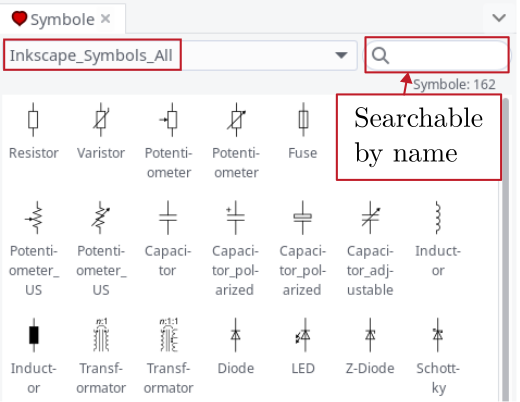

# Electrical Drawing Symbols for Inkscape
Symbols for electrical engineering applications. Contains block diagrams and symbols. Typically used for technical drawings in
 * Bachelor / Master / Ph.D. theses,
 * Scientific papers, and
 * Technical manuals.
# Getting started
 * Download and install [Inkscape](https://inkscape.org/).
 * Download the latest version of [Inkscape_Symbols_All.svg](https://github.com/upb-lea/Inkscape_electric_Symbols/blob/master/Inkscape_Symbols_All.svg).

After doing so, open Inkscape_Symbols_All.svg and copy the symbols of interest to your Inkscape worksheet.

Optional: If you want to receive updates, clone this repository by using [git](https://git-scm.com/):
```
cd /Documents/Folder/of/Interest   
git clone git@github.com:upb-lea/Inkscape_electric_Symbols.git
```
Optional: To update the symbols library, use
```
git pull
```
Optional: Click the `watch` button to receive update notifications.

# Overview


# Using the library (Important!)
* Open Inkscape_Symbols_All.svg and copy the symbols of interest to your Inkscape sheet.
* __Do not resize the individual elements. Use the size as given!__     
* __Always draw on the grid!__
* __Enable snapping! (see settings screenshots below)__     
* Grid on/off by `#`-key
* Recommended way to move objects: drag them next to an endpoint (it makes a difference where you touch the component), to make sure to work on the rough grid (recommended, not the fine one).
* Recommended way to modify wires: mark line (`F1`-key for mark-tool), press `F2`-key, click on the end of the line so that the fixed point becomes red, now you can move this point.     
* Recommended way to rotate the component: mark the component and use the `rotate` buttons at the upper part of the toolbar.      
* Recommended way to mirror components: press `v` (vertical) or `h` (horizontal).
* Recommended way to changes text: click on text, press `t` for editing mode.
* Change color of area: mark area, click on Color.
* Change color of line: mark line, `shift` + click on Color.
* Colors used in this template: `GNOME HIG Colors`.  
* Recommended snapping settings, can be set top right inside Inkscape       


# Examples
### Example Boost Converter

### Example Dual Active Bridge Converter

### Example Switching Behavior


# Set drawing size
The best thing to do before you start drawing is to consider where the drawing will be used. For example, if the drawing will be used on an A4 (210 mm width) paper with 2.5 cm margins on each side, set the drawing width within Inkscape to 160 mm. For two-column text, use 80 mm image width. This way you will get good drawing results relative to the written text. 

# Use high quality vector graphics inside your documentation software
Follow the steps to use vector graphics in your documentation software. The vector graphics are rendered in very good image quality, unlike conventional png images. However, each program has its own characteristics and requires a different file format. 
### LaTeX
 * In Inkscape: `File` -> `Save Copy` -> `yourdocument.pdf`. 
 * Include this `pdf` in your LaTeX document.

### LibreOffice
Drag and drop the Inkscape `.svg`-file into your writer/impress document.

### MS Office
 * In Inkscape: `File` -> `Save Copy` -> `yourdocument.emf`. 
 * Include this `emf`-file in your Word/PowerPoint document.

# Usage of Inkscape integrated symbols (Beta!)
Install the symbol sheet into the following directory:     
Windows: `C:\Users\your_usersname\AppData\Roaming\inkscape\symbols`     
Linux: `~/.config/inkscape/symbols`     
macOS: `/Users/your_usersname/.config/inkscape/symbol`     

Open `Object` -> `Symbols` in a new document. In the symbol drop-down menu, choose `Inkscape_Symbols_All`. All symbols are searchable by name.

Note: Not all symbols from the main document are included here.



# Use LaTeX font inside the figures for LaTeX documents
### Option 1: Use font by LaTeX
Save your drawing as `.pdf` file. While saving, use the following option in the export dialog.
     
Now, your figure is exported e.g. as `example_figure.pdf_tex`. Also, LaTeX formulas are supported using the `.pdf_tex` format.

LaTeX example code, to include this figure into your LaTeX document. Add the figure path `\graphicspath{{figures/}}` to your settings.
```
\begin{figure}[htb]
	\centering
	\def\svgwidth{\linewidth}
	\input{figures/example_figure.pdf_tex}
	\caption{This is a pdf figure, where the font is made by \LaTeX.}
	\label{fig:example_figure}
\end{figure}
```

### Option 2: Linux users only 
Debian based systems (untested):
```
apt install lmodern
``` 

Arch Linux based systems:
```
pacman install otf-latin-modern otf-latinmodern-math
```
Now, you will find the font `Latin Modern Roman` inside your Inkscape fonts.


# Bug Reports
Please use the issues report button within GitHub to report bugs.

# Contributing to this repository
For new symbol requests, please open an issue with a single example drawing attached. We will then redraw the symbol, modify it if necessary to fit with the other symbols, and add it to the library. 
* Please use lines with rounded ends.
* Always draw on the grid (rough or fine).
* Points of components to which a wire can be connected must lie on the rough grid.
* Use standard line width.

# Changelog
Find the changelog [here](https://github.com/upb-lea/Inkscape_electric_Symbols/blob/master/CHANGELOG.md).

# Troubleshooting
 * Make sure that you run the latest version of [Inkscape](https://inkscape.org/).
### Different grid settings when opening older (< `1.3.2`) drawings with newer Inkscape version (`1.3.2` and up)
There is a mismatch in the grid settings. This needs to be restored for every single (old) document.
`File` -> `Document settings` under `Grid`: The raster unit is set to `mm` but should be set to `px`.


